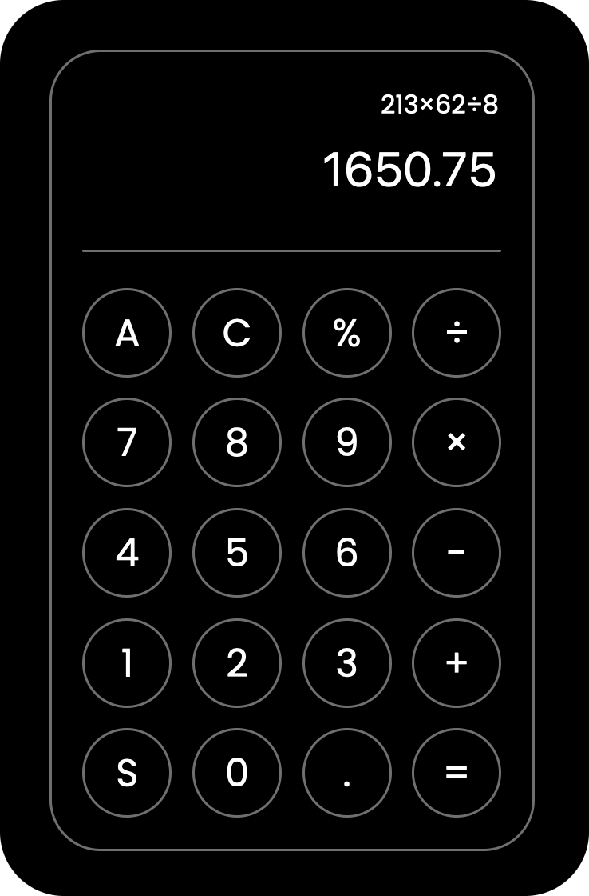

# Javascript Calculator
A small and lightweight calculator library/template, It gives a good illustration on how a calculator parses a string and resolves the containing calculation. 
It has no dependencies and can be used freely in a web application for example. 

Various things that it can do are...
* Handle floating point inaccuracies and return a high resolution result.
* Perform complex calculations such as π+5π2 and 5!%4^2.
* The unminified version is just 1.4 KB large making it capable of being used in virtually any package.

It is also fairly light-weight & thus it is easy to embed without any major drawbacks.



# Basic Usage
You can try it out directly in your browser although locally. The calculator logic is packaged in the same file as the demo. You can extract the logic and build around it if you wish to do so.
The functionality can easily be extended to include more advanced operations such as the usage of cosine and the processing of other vectors.


```javascript
// Parse String And Return Result Of Given Calculation;
let i=res(P.value);if(Number.isInteger(i)){P.value=i}else{P.value=parseFloat(i.toFixed(8))};P.focus();
```

# License
This project is part of the public domain, feel free to use it in whatever form you want without any restrictions.
